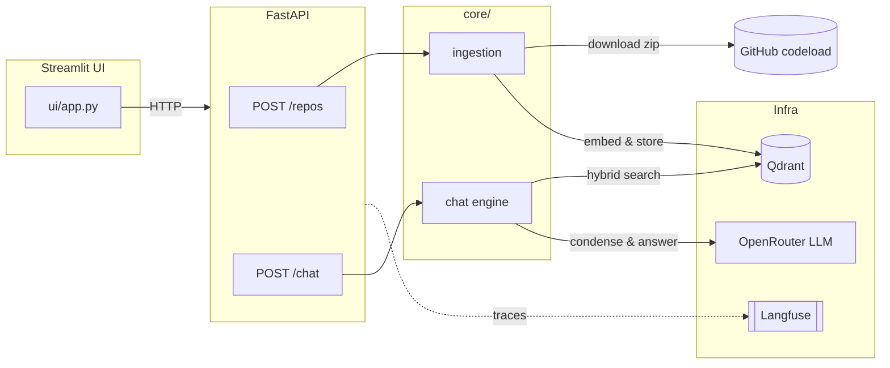

# github-repo-chat

Chat with any public GitHub repository: README, docs and source code are downloaded, split and
indexed with LlamaIndex into Qdrant, then answered through an LLM with citations that link back to
the exact file and line on GitHub.

Demo GIF: coming soon.

## Features

- Point at any public repo (`owner/name` or a GitHub URL, optional branch) and index it in the
  background, with live progress in the UI.
- Hybrid retrieval (dense FastEmbed + sparse BM25) in Qdrant, with an optional cross-encoder
  reranker.
- Answers grounded only in retrieved context, with numbered citations linking to
  `github.com/<owner>/<repo>/blob/<ref>/<path>#L<line>`.
- Incremental re-indexing: unchanged files are skipped by content hash, changed files are
  re-embedded, removed files are deleted.
- Multi-turn chat: follow-up questions are condensed into a standalone question before retrieval.
- One Langfuse trace per chat request, with tokens, cost and latency shown in the UI.
- Streamlit UI with example repositories and questions, source cards and run metrics; FastAPI
  backend with OpenAPI docs.

## Architecture



See [`docs/architecture.md`](docs/architecture.md) for data-flow diagrams and the design
decisions behind each component.

## Quickstart

### Full stack with Docker

```bash
docker compose up --build
```

- UI: http://localhost:8501
- API docs: http://localhost:8000/docs

Copy `.env.example` to `.env` first if you want the LLM and Langfuse tracing to work (see
[Configuration](#configuration)); without an OpenRouter key ingestion works but chat calls fail.

### Local development

```bash
uv sync
docker compose up -d qdrant
uv run uvicorn github_repo_chat.api.main:app --reload
uv run streamlit run src/github_repo_chat/ui/app.py
```

## Configuration

All settings are environment variables read by `src/github_repo_chat/config.py` (copy
`.env.example` to `.env` for local development).

| Variable | Default | Description |
| --- | --- | --- |
| `OPENROUTER_API_KEY` | `""` | API key for OpenRouter; required for chat answers. |
| `OPENROUTER_BASE_URL` | `https://openrouter.ai/api/v1` | OpenRouter-compatible API base URL. |
| `LLM_MODEL` | `google/gemini-3.8-flash` | Chat model id passed to OpenRouter. |
| `LLM_TEMPERATURE` | `0.1` | Sampling temperature for answers and condensing. |
| `LANGFUSE_PUBLIC_KEY` | `""` | Langfuse public key; tracing is disabled when empty. |
| `LANGFUSE_SECRET_KEY` | `""` | Langfuse secret key. |
| `LANGFUSE_HOST` | `https://cloud.langfuse.com` | Langfuse host (self-hosted or cloud). |
| `QDRANT_URL` | `http://localhost:6333` | Qdrant endpoint. |
| `EMBED_MODEL` | `BAAI/bge-small-en-v1.5` | Dense FastEmbed embedding model. |
| `SPARSE_MODEL` | `Qdrant/bm25` | Sparse FastEmbed model for BM25 hybrid search. |
| `RERANK_MODEL` | `""` | FastEmbed cross-encoder model; reranking is disabled when empty. |
| `MAX_FILES` | `500` | Maximum number of files indexed per repository. |
| `MAX_FILE_BYTES` | `200000` | Files larger than this are skipped. |
| `MAX_ARCHIVE_BYTES` | `100000000` | Maximum size of the downloaded zip archive. |
| `DOWNLOAD_TIMEOUT_S` | `60.0` | Timeout for downloading the repository archive. |
| `CODE_CHUNK_LINES` | `60` | Target lines per code chunk. |
| `CODE_CHUNK_MAX_CHARS` | `2000` | Maximum characters per code chunk. |
| `TEXT_CHUNK_TOKENS` | `512` | Target tokens per text/markdown chunk. |
| `TOP_K` | `6` | Number of chunks used to answer a question. |
| `HISTORY_TURNS` | `6` | Number of recent chat turns kept for condensing and context. |
| `API_URL` | `http://localhost:8000` | Backend URL used by the Streamlit UI. |

## API endpoints

| Method & path | Description |
| --- | --- |
| `POST /repos` | Starts background ingestion of a repository (`{url, branch?}`), returns its status. |
| `GET /repos` | Lists indexed and in-progress repositories with file/chunk counts and status. |
| `GET /repos/{id}` | Status of one repository (progress while indexing, counts once ready). |
| `DELETE /repos/{id}` | Deletes a repository's indexed collection. |
| `POST /chat` | Answers a question about an indexed repository (`{repo, question, history?}`). |
| `GET /health` | Liveness plus Qdrant reachability. |

Full request/response schemas are served at http://localhost:8000/docs.

## Testing

```bash
uv run pytest tests/unit -q      # fast unit tests, no keys, no network
uv run pytest -m integration     # needs `docker compose up -d qdrant`
uv run pytest -m llm             # real LLM calls through OpenRouter (manual only)
```

The `llm`-marked golden-set evaluation also runs on demand in CI, see
[`.github/workflows/llm-eval.yml`](.github/workflows/llm-eval.yml).

## Observability

Langfuse tracing (via OpenInference's LlamaIndex instrumentation) is optional and enabled by
setting `LANGFUSE_PUBLIC_KEY` and `LANGFUSE_SECRET_KEY`. Each `POST /chat` request opens one root
span; the retrieval, embedding and LLM calls made underneath it become child spans in the same
trace, with token usage and, when OpenRouter reports it, cost. The Streamlit UI shows token count,
cost and latency for every answer, with a link to the corresponding Langfuse trace.

## Tech stack

FastAPI, Streamlit, LlamaIndex, Qdrant (hybrid dense + BM25 sparse search), FastEmbed
(embeddings and reranking), OpenRouter (LLM access), Langfuse + OpenInference (tracing),
uv (dependency management), Docker Compose.

## Development

This project is developed with an AI-assisted workflow using [Claude Code](https://claude.com/claude-code):
project context in [`CLAUDE.md`](CLAUDE.md), specialized agents, slash commands and hooks in
[`.claude/`](.claude/) (auto-formatting, secret protection, session context).

## License

MIT
