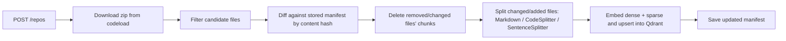
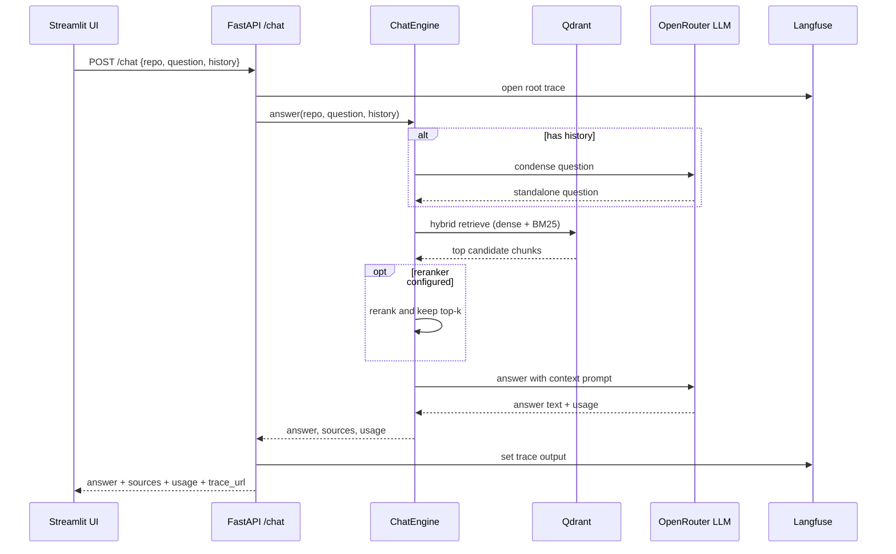

# Architecture

## Components

- **UI (`ui/`)** — Streamlit app. Talks to the API over HTTP only, never imports `core/`.
- **API (`api/`)** — FastAPI app: routers for repos, chat and health, an in-memory job registry
  for ingestion progress, and a `Services` container built once at startup.
- **Core (`core/`)** — domain logic with no framework dependency: archive download and filtering,
  splitting, diffing/incremental re-index, the chat engine (condense, retrieve, rerank, answer,
  citations).
- **Infra (`infra/`)** — adapters to the outside world: `qdrant_store.py` (hybrid vector store and
  manifest registry) and `tracing.py` (Langfuse/OpenInference).
- **LLM (`llm/`)** — `factory.py` builds the OpenRouter LLM, the FastEmbed embedding/sparse/rerank
  models in one place; `prompts.py` holds every prompt template.
- **Qdrant** — one hybrid collection per repository plus a registry collection for manifests; the
  only stateful service.

## Data flow

### Ingestion (`POST /repos`)

### Chat request (`POST /chat`)

## Design decisions

Each decision lists the choice and the trade-off behind it.

### Ingestion

- **Default branch without the GitHub API.** A missing branch becomes the ref `HEAD`: codeload
  serves `zip/HEAD` and github.com resolves `blob/HEAD/<path>`, so no API call (and no token or
  rate limit) is needed. Trade-off: citation links follow the branch head, so they can drift if the
  repository changes after indexing.
- **Archive read in memory, never extracted.** The zip is streamed with a size cap
  (`MAX_ARCHIVE_BYTES`) and files are read straight from it. No temporary directory to clean and no
  path-traversal risk. Trade-off: peak memory is about the archive size (100 MB by default).
- **Two-phase filtering.** Path and size rules run on zip metadata first; content rules (binary,
  minified, generated markers) run only on the files that survive, in priority order, until the
  500-file cap is reached. Minified/generated checks apply only to source files, because Markdown
  often has very long lines. Priority: READMEs, other docs, then source files by depth.
- **Symbols and start lines computed after splitting.** LlamaIndex splitters do not report symbol
  names or reliable line numbers, so each chunk is located in its file (first line match, moving
  cursor) and named by a per-language regex outline of definitions / Markdown headings: the first
  definition inside the chunk, else the enclosing one. Trade-off: regexes miss some constructs
  (e.g. plain C functions), in which case the symbol is empty but the path and line are still right.
- **No NLTK / tiktoken at split time.** `SentenceSplitter` gets a regex sentence splitter and a
  word/punctuation token counter. This avoids runtime data downloads (and NLTK refusing the
  hard-linked data files that `uv` installs). Trade-off: token counts are approximate, which only
  shifts chunk boundaries slightly.
- **Incremental re-index by file hash.** A manifest `{path: sha256}` is stored per repository.
  Changed, added and removed files are deleted first (all chunks of a file share the path as
  document id), the manifest is saved with only the unchanged files, then new chunks are embedded
  and the final manifest is written. A crash halfway therefore leaves files marked as missing, and
  the next run re-embeds them instead of skipping them.

### Query

- **Condense + context.** With history, the follow-up is condensed into a standalone question for
  retrieval, and the recent turns are also passed to the answering prompt. Without history no
  extra LLM call is made.
- **No LLM call without context.** If retrieval returns nothing, the fixed "I don't know" answer is
  returned directly.
- **Prompt-injection hygiene.** Excerpts are wrapped in `<context>` / `<excerpt>` tags, the system
  prompt declares them untrusted, and closing tags inside repository content are neutralized.
- **Optional reranking** takes a larger candidate pool (3 x top-k) and keeps the best top-k.

### Storage and infrastructure

- **Manifest registry in Qdrant.** Per-repository manifests (file hashes, chunk count, branch,
  indexed time) are payload-only points in a `github_repo_chat_registry` collection, so Qdrant
  is the only stateful service. Trade-off: no relational queries, and the whole hash map is
  rewritten on each save (fine for ≤500 files).
- **One hybrid collection per repository** (`repo__<owner>--<name>`): dense FastEmbed vectors plus
  BM25 sparse vectors with Qdrant's IDF modifier, fused with relative-score fusion. Deleting a
  repository drops its collection, and a file's chunks are removed with a single `doc_id` filter.
  The sparse side retrieves 2 x top-k before fusion.
- **BM25 encoders built once** and passed to `QdrantVectorStore`: documents use `embed`, queries
  use `query_embed` (the library default uses `embed` for both and reloads the model on each
  store). Trade-off: a little glue code in `llm/factory.py`.
- **Tracing through OpenInference.** Langfuse v4 is OpenTelemetry-based: the LlamaIndex
  instrumentor emits retrieval / embedding / LLM spans with token usage, and the API opens one
  root span per chat request so they group into one trace. Without keys, `Tracer` is a no-op.
  Cost appears when Langfuse knows the model's price (custom prices can be added in Langfuse for
  OpenRouter model ids).
- **Qdrant client and server pinned together** (client 1.19, server `v1.19.1`): the client warns
  when minor versions differ by more than one.

### API

- **Repository id = job id.** `POST /repos` returns the repository id (`<owner>--<name>`), which
  is also the path parameter of `GET/DELETE /repos/{id}`. One id per repository keeps the API
  small. At most one job per repository can be active (a second one gets `409`); `DELETE`
  also claims the repository with a `deleting` job, so a re-index cannot start while its
  collection is being dropped and then silently vanish.
- **In-memory job registry + FastAPI background tasks.** Ingestion runs in the server threadpool,
  and its progress (stage, done/total) and errors live in a thread-safe dict. Trade-off: job
  status is lost on restart and jobs do not scale across workers, which is fine for a
  single-user demo (no multi-user in scope). Indexed repositories survive restarts through the
  Qdrant manifests, so `GET /repos` merges manifests with live jobs.
- **Stateless chat.** The client sends the recent history with each `POST /chat`; the server
  keeps only the last `HISTORY_TURNS` messages. No session store is needed.
- **Limits at the edge.** Pydantic schemas cap URL (300 chars), question (2000), history
  (20 messages of up to 8000 chars), and allow only `user`/`assistant` roles. Domain errors map to
  HTTP codes in one place (`api/main.py`).
- **Dependency container.** `Services` bundles settings, store, chat engine, tracer, jobs and the
  archive fetcher. `create_app(services)` lets tests inject in-memory Qdrant, a mock embedding, a
  scripted LLM and a fixture zip, with no network or keys.

### UI and packaging

- **UI over HTTP only.** The Streamlit page talks to the API through `ui/client.py` and never
  imports `core/`, so the UI can be replaced (or run on another host) without touching the backend.
  Rendering helpers live in `ui/components.py`; `ui/app.py` is the only page.
- **Demo-first empty states.** With no repository indexed the page offers `fastapi/fastapi`,
  `pallets/flask` and `langchain-ai/langgraph` as one-click demos; an empty chat offers three
  example questions. Every answer shows source cards, token / cost / latency metrics and, when
  tracing is on, a link to its Langfuse trace.
- **Polling for progress.** The UI polls `GET /repos/{id}` once a second while indexing.
  Trade-off: simpler than server-sent events or websockets, and good enough for one user.
- **One image, two commands.** The same Docker image runs the API (default `uvicorn` command) and
  the UI (`streamlit run`), as a non-root user. FastEmbed models are cached in a named volume, so
  they download only on the first start. CI builds and smoke-tests the image on every PR and pushes
  it to GHCR from `main`.

### Security

Findings of the one-off `security-auditor` pass and how they are handled:

- **No SSRF surface.** Only `github.com` references are accepted; the download URL is always
  built as `https://codeload.github.com/<owner>/<name>/zip/<ref>` from validated parts.
- **Archive limits.** Streamed download capped at `MAX_ARCHIVE_BYTES`, at most 100 000 zip
  entries, per-file size checked on zip metadata before decompression, at most `MAX_FILES` files.
- **Prompt injection.** Repository text is delimited and declared untrusted, delimiter-closing
  tags are neutralized, and the LLM has no tools: a successful injection can only produce a
  misleading answer, which the citations let the reader verify.
- **Error hygiene.** Ingestion failures show domain messages (e.g. "repository not found");
  unexpected errors show a generic message and are logged with full detail.
- **Dependencies.** `pip-audit` runs in CI.
- **Accepted risk: no authentication or rate limiting.** Out of scope per the design (single-user
  demo). Anyone who can reach the API can trigger ingestion and spend LLM credits, so do not expose
  ports 8000/8501 publicly without an authenticating reverse proxy.
