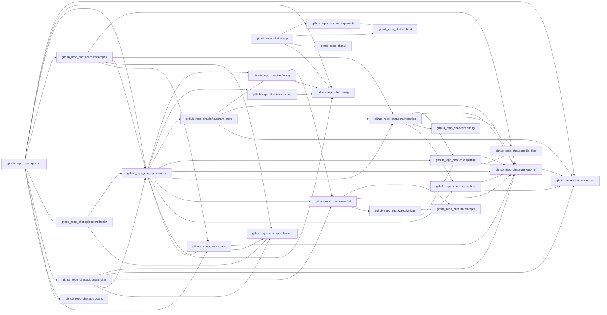

# Code map

Generated by `scripts/code_map.py`. Do not edit by hand.

## Modules not imported by any other module

- `github_repo_chat.api`
- `github_repo_chat.core`
- `github_repo_chat.infra`
- `github_repo_chat.llm`
